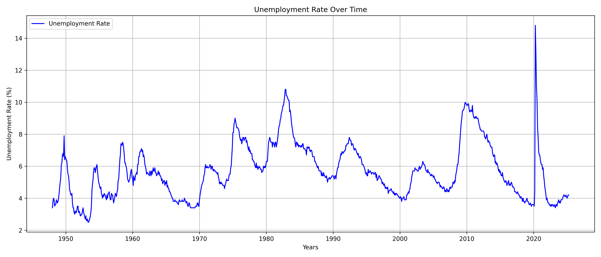
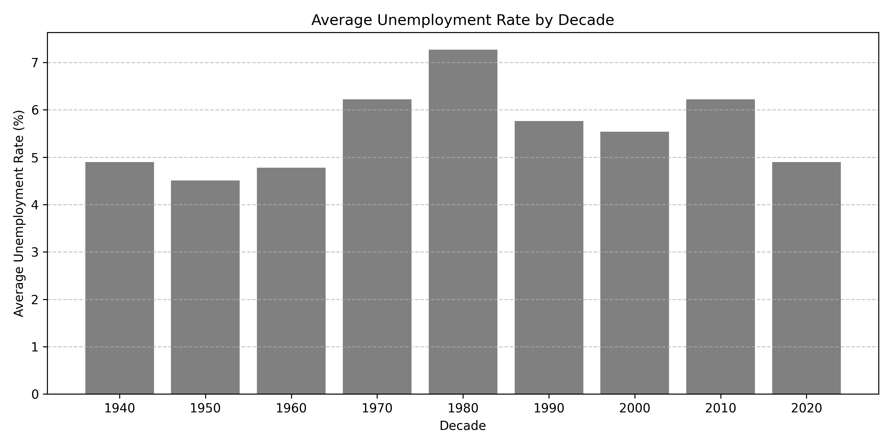

# Unemployment Rate Analysis Project
==================================

## **Project description:**

Welcome! This project is all about learning how to build and manage a real-world data analysis workflow from the ground up.
We will be working with the UNRATE.csv dataset, which contains monthly U.S. unemployment rates dating back to 1948. It is a great opportunity to explore economic trends—especially events like the COVID-19 pandemic and turn raw data into meaningful insights.
But this project is not just about analysis. It is also designed to help you build strong technical habits. 

Throughout the setup, you will:
  * Use UV, a modern and lightning-fast Python package manager, to install your tools and create a clean environment.
  * Organize your files into a clear project structure that mirrors what professionals use.
  * Set up version control with Git, and push your work to GitHub, just like in a collaborative team setting.
  * Use VSCode and Jupyter Notebook to write and run your Python code in an interactive and reproducible way.
  * Practice writing code that is clean, documented, and ready to share.

By the end of this, you will not only have performed a real data analysis project, but also know how to set up your environment.

## **Virtual Environment Setup Instructions (macOS):**

 1. First, create your project folder:

        mkdir business-data-analysis
        cd business-data-analysis

 2. Copy the `UNRATE.csv` dataset into this directory:

        cp ~/Downloads/wld-assignment-01/UNRATE.csv ./UNRATE.csv

 3. Create a virtual environment with Python 3.12:

        uv venv --python 3.12

 4. Activate the environment:

        source .venv/bin/activate

 5. Install necessary packages:

        uv pip install pandas matplotlib jupyter ipykernel

 6. Register the Jupyter kernel:

        python -m ipykernel install --user --name=business-analysis --display-name="Business Analysis (UV)"

 7. Open VSCode in your project directory:

        code .
    Alternatively, open VSCode manually and go to  
        `File > Open Folder` → select `business-data-analysis`.

 8. Create a new Jupyter notebook:

      * Press `Ctrl+N` (Windows) or `Cmd+N` (macOS)
      * Save it as `unemployment_analysis.ipynb`
      * VSCode will switch to notebook mode automatically

 9. Select your Jupyter kernel:

        Click on the kernel selector in the top-right
        Choose "Business Analysis (UV)"
        If not found, select Python 3.12.x (.venv)

> Tip:
> If your notebook doesn't run, double-check the environment is activated and that the correct interpreter is selected.

Here is a code sample to test everything is working:

~~~python
import pandas as pd
import matplotlib.pyplot as plt

print("All packages imported successfully!")
~~~

Run the above in a notebook cell. If it prints successfully without errors, you are ready to begin your analysis!

## **How to run the analysis:**

We will run **six main parts** in the analysis process:

 1. **Setup and Data Loading:**

      * Import libraries and confirm setup
      * Load the dataset and print basic info

 2. **Exploratory Data Analysis:**

      * Check dataset shape and data types
      * View basic statistics and value ranges
      * Convert observation_date to datetime

 3. **Statistical Summary:**

      * Compute overall mean, min, and max
      * Analyze unemployment by decade and year

 4. **Answering Business Questions:**

      * What was the unemployment rate during the 2008 financial crisis?
      * What happened during the COVID-19 pandemic?
      * What’s the trend in unemployment over the last 10 years?
      * Which decade was the most stable (lowest standard deviation)?

 5. **Data Visualization:**

      * Plot the unemployment trend over time
      * Annotate significant peaks (e.g., 2008 crisis, COVID-19, 1980s)
      * Visualize averages by year and decade using line and bar plots

        (Use `matplotlib.pyplot` with `figsize`, `title`, `xlabel`, `ylabel`, etc.)

 6. **Further Analysis:**

      * Conduct a focused review on early 1980s recession

Each part builds on the previous one, leading to a full picture of how unemployment in the U.S. has evolved over time and how it responded to major global and national crises.

## **Key findings from your analysis:**

The unemployment rate in the United States has demonstrated a **clear cyclical trend**, rising sharply during periods of economic stress and gradually declining during recoveries. Through our analysis, we have identified key historical spikes and patterns.

### Long-Term Observations

- **Overall average unemployment rate**: **5.68%**
- **Minimum recorded rate**: **2.5%** in **May and June 1953**
- **Maximum recorded rate**: **14.8%** in **April 2020**

#### Unemployment Statistics by Decade:

| Decade | Mean (%) | Min (%) | Max (%) | Std Dev | Count |
|--------|----------|---------|---------|---------|--------|
| 1940s  | 4.90     | 3.4     | 7.9     | 1.38    | 24     |
| 1950s  | 4.51     | 2.5     | 7.5     | 1.29    | 120    |
| 1960s  | 4.78     | 3.4     | 7.1     | 1.07    | 120    |
| 1970s  | 6.22     | 3.9     | 9.0     | 1.16    | 120    |
| 1980s  | 7.27     | 5.0     | 10.8    | 1.48    | 120    |
| 1990s  | 5.76     | 4.0     | 7.8     | 1.05    | 120    |
| 2000s  | 5.54     | 3.8     | 10.0    | 1.45    | 120    |
| 2010s  | 6.22     | 3.5     | 9.9     | 2.06    | 120    |
| 2020s* | 4.90     | 3.4     | 14.8    | 2.28    | 64     |

> The most stable decade was the **1990s**, with the lowest standard deviation of **1.05**.

---

### Major Economic Events and Their Impact

#### The 2008 Financial Crisis  
**Period Analyzed**: January 2006 – December 2009  
- **Peak Unemployment**: **10.00%** in **October 2009**  
- **Average Unemployment**: **6.08%**

#### COVID-19 Pandemic  
**Period Analyzed**: January 2020 – May 5, 2023  
- **Peak Unemployment**: **14.80%** in **April 2020**  
- **Average Unemployment**: **5.43%**

---

### 10-Year Trend Overview

The past 10 years reflect a period of **relative stability** between 2015 and early 2020, followed by a sharp spike due to COVID-19, and then a gradual recovery.

---

### Historical Perspective

A broader look from 1948 to 2025 confirms a repeating cycle of economic contractions and recoveries. The highest spikes align with:

- The early 1980s recession (Additional Analysis)
- The 2008 financial crisis
- The COVID-19 pandemic

> The COVID-19 had the highest recorded unemployment rate in recent U.S. history by **14.8%** in **April 2020**, rising more sharply and suddenly than during the 2008 crisis that recorded a rate of **10.00% in **October 2009**

---

### Summary Insight

The unemployment rate has followed a recognizable boom-bust pattern, with significant peaks in times of crisis. Despite short-term disruptions—especially during COVID-19 the overall trend in recent decades has been one of gradual decline and increased stability, particularly from 2010 to 2020. By analyzing unemployment across different eras, we gain valuable insight into how economic shocks impact labor markets and how recovery patterns vary over time.

Looking at unemployment trends also gives us a clearer picture of how the economy shapes real business decisions. For example, during the early 1980s recession, unemployment steadily climbed to 10.8% by late 1982. In the 2008 financial crisis, it peaked at 10.0% in October 2009, and during the COVID-19 pandemic, it spiked sharply to a record 14.8% in April 2020. These periods often bring a larger talent pool, but they also signal weaker consumer spending and greater economic uncertainty. In contrast, more stable periods—like the 1990s, when the average unemployment rate was 5.76% with the lowest standard deviation (1.05) are generally better for growth and investment. Recognizing these patterns helps businesses plan more effectively: anticipating hiring conditions, timing expansions, assessing market demand, and managing economic risk with greater confidence.

## **Data source attribution:**

Here's a link to [UV documentation](https://github.com/astral-sh/uv), to the [data source](https://fred.stlouisfed.org/series/UNRATE)[^1]. 

[^1]: The `UNRATE.csv` file is sourced from FRED, the Federal Reserve Economic Data platform.

Material Summary:

tool        material       purpose
----------  -------------  ----------------------------
UV          virtualenv     Environment & package setup
Jupyter     notebook       Interactive analysis
GitHub      repo           Version control & sharing

Table: Tools used in this project

***

Reference list:

Federal Reserve Economic Data (FRED)
  : [U.S. Unemployment Rate Dataset](https://fred.stlouisfed.org/series/UNRATE)

2008 Financial Crisis
  : [Wikipedia](https://en.wikipedia.org/wiki/2008_financial_crisis)

BLS Spotlight
  : [PDF on Recession](https://www.bls.gov/spotlight/2012/recession/pdf/recession_bls_spotlight.pdf)

COVID vs. Recession
  : [Pew Research](https://www.pewresearch.org/short-reads/2020/06/11/unemployment-rose-higher-in-three-months-of-covid-19-than-it-did-in-two-years-of-the-great-recession/)

Early 1980s Recession
  : [Wikipedia](https://en.wikipedia.org/wiki/Early_1980s_recession)

In addition, I referred to this excellent Markdown formatting sample for styling guidance:  
→ [Markdown Sample – GitHub Gist by rt2zz](https://gist.github.com/rt2zz/e0a1d6ab2682d2c47746950b84c0b6ee)

## **GenAI usage acknowledgment:**

This project was completed independently, but I used **ChatGPT** for assistance in specific areas to improve clarity, formatting, and plotting.

Here is a list of contributions where ChatGPT was used:

  * Rewriting and refining narrative explanations — including the summaries for the COVID-19 pandemic and 2008 financial crisis
  * Helping format and organize the `README.md` file in a clear and consistent way
  * Formating the results.txt file and checking grammar 
  * Adding annotations to peak unemployment values on plots:

        # Use of ChatGPT to plot the peak in the graph:
        plt.text(peak_date, peak_value + 0.3, f'Peak: {peak_value:.1f}%\n({pd.to_datetime(peak_date).strftime("%b %Y")})',
                 ha='center', va='bottom', fontsize=9, backgroundcolor='white')

  * Fixing the x-axis labels to show one tick per year on the unemployment rate plot:

        # ChatGPT help for that part of fixing the unique years in the x-axis
        years_to_show = sorted(last_10_years['year'].unique())
        plt.xticks(
            ticks=[last_10_years[last_10_years['year'] == y]['observation_date'].iloc[0] for y in years_to_show],
            labels=years_to_show,
            rotation=45)

  * Adjusting pandas output settings to view all data rows:

        # Show all rows in output (help ChatGPT to see all the output)
        pd.set_option('display.max_rows', None)
        print(f"\n The trend in unemployment over the last 10 years:\n{simple_table}")

These tools helped enhance both the technical and presentation quality of the project.

## **Configuration and Submission**

Before this step, we should have created and committed the following files to our project:

* `unemployment_analysis.ipynb` — the Jupyter notebook containing the analysis  
* `unemployment_analysis.py` — the Python script version converted from the notebook  
* `README.md` — this documentation file explaining setup, usage, and findings  
* `results.txt` — a summary of answers to business questions and key statistics

Once those files are in place, follow these steps to finalize and submit your project:

 1. Stage all files for commit:

        git add .

 2. Commit with a descriptive message:

        git commit -m "Complete unemployment data analysis"

 3. Push to GitHub on the main branch:

        git push origin main

> Make sure it includes both the `.ipynb` notebook and the `.py` script.

Confirm the upload by checking your GitHub repository online.

~~~ Here is the expected project structure:
business-data-analysis/
├── .git/
├── .gitignore
├── .venv/                        # (not tracked by Git)
├── UNRATE.csv                    # (provided separately)
├── README.md
├── unemployment_analysis.ipynb  # Your notebook
├── unemployment_analysis.py     # Converted Python script
├── results.txt                   # Business question answers and stats
├── unemployment_analysis.png    # Example visualization
├── requirements.txt             # Optional list of dependencies
~~~

Ensure that:
* `.venv/` and any OS/editor files are included in `.gitignore`
* All key files are committed and up‑to‑date
* The code runs without errors and the README explains the workflow clearly
* Visualizations and findings are present and properly labeled

